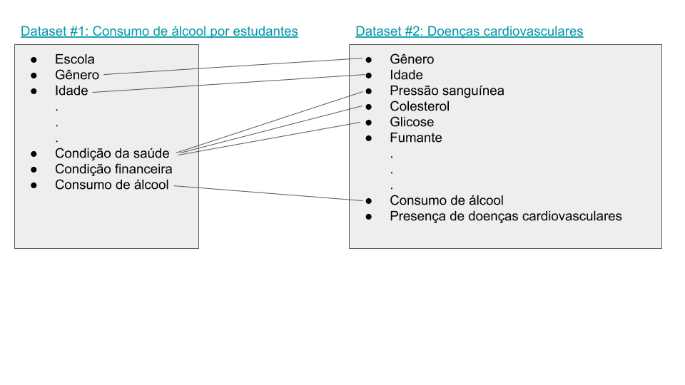

# Tarefa 1 sobre APIs de acesso
[Notebook](notebook/Lab01_536.ipynb)
# Tarefa 2 sobre Engenharia reversa

Datasets utilizados na tarefa 2: 

- https://www.kaggle.com/sulianova/cardiovascular-disease-dataset
- https://www.kaggle.com/uciml/student-alcohol-consumption?select=student-mat.csv

Podemos perceber que existem varios pontos em comum entre o consumo de alcool e a ocorrencia de doenças cardiovasculares. Podemos ainda ampliar o estudo e relacionar como a condição financeira influencia esses fatores

